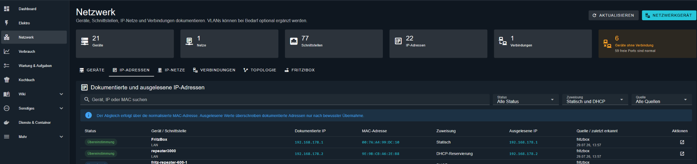
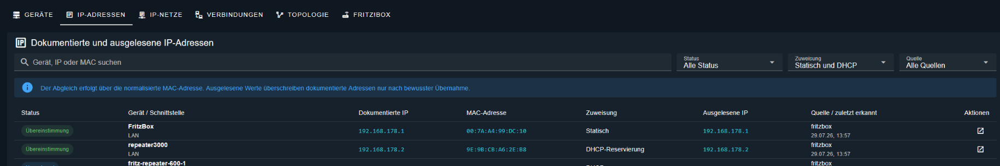

# DocOfHome

**Know your home.** DocOfHome ist eine selbst gehostete Hausdokumentation für Technik, Netzwerk, Elektro, Verbrauch, Wartung, Dokumente, Bilder und wiederkehrende Aufgaben. Die Anwendung läuft lokal im eigenen Docker-Umfeld und hält technische Dokumentation und Live-Daten dort zusammen, wo sie benötigt werden.

## Funktionsbereiche

- **Assets & Räume** – Geräte, Installationen, Produkte, Standorte und Beziehungen dokumentieren.
- **Elektro** – Verteilungen, Stromkreise, Schutzgeräte, Schienen und Topologie pflegen.
- **Netzwerk** – Geräte, Schnittstellen, IP-Adressen, Netze und Verbindungen dokumentieren; FRITZ!Box-Daten per MAC-Adresse abgleichen.
- **Verbrauch** – Zählerstände, Ableseerinnerungen und Verbrauchsvergleiche verwalten.
- **Wartung & Aufgaben** – wiederkehrende Tätigkeiten, Historien, Fälligkeiten und Kosten erfassen.
- **Kochbuch** – strukturierte Rezepte mit Kochmodus und lokalen/Immich-Rezeptbildern.
- **Bilder & Dokumente** – lokale Dokumentation mit optionalen Immich- und Nextcloud-Integrationen.
- **Dienste & Container** – Docker-Container vom UGREEN NAS importieren und Status, Images, Ports, Netzwerke und Mounts aktuell halten.
- **Home Assistant & MCP** – optionale Integrationen für Smart-Home-Dokumentation und ChatGPT-Zugriff.

## Screenshots

### Netzwerkübersicht



### Sortierbarer IP-Abgleich



## Installation mit Docker Compose

```bash
git clone https://github.com/Scotty042/DocOfHome.git
cd DocOfHome
docker compose up -d --build
```

Standardmäßig ist DocOfHome anschließend über Port `8088` erreichbar. Persistente Daten liegen im lokalen Verzeichnis `./data`.

### Docker-Integration auf dem UGREEN NAS

Für den lesenden Containerimport benötigt DocOfHome Zugriff auf den Docker-Engine-Socket. Die mitgelieferte `compose.yaml` bindet `/var/run/docker.sock` ein. DocOfHome selbst verwendet dafür ausschließlich lesende `GET`-Anfragen. Der Zugriff auf einen Docker-Socket ist grundsätzlich privilegiert; die Installation sollte deshalb nur in einem vertrauenswürdigen lokalen Umfeld betrieben werden.

In **Dienste & Container** anschließend:

1. das UGREEN NAS als Host-Asset auswählen,
2. den Docker-Socket prüfen,
3. das gewünschte Aktualisierungsintervall wählen,
4. **Jetzt aktualisieren** ausführen.

## Optionale Integrationen

DocOfHome unterstützt unter anderem Home Assistant, Immich, Nextcloud, Paperless-ngx und FRITZ!Box. Integrationen lassen sich einzeln aktivieren und testen. Paperless dient dabei als externe Dokumentenablage: Wartungs- und Historieneinträge können manuell mit vorhandenen Dokumenten verknüpft werden, ohne PDFs in DocOfHome zu duplizieren. Zugangsdaten werden nicht in Exporten oder Diagnoseinformationen aufgenommen.

## Entwicklung

Backend: FastAPI, SQLModel und Alembic. Frontend: Vue 3, TypeScript und Vuetify. Die CI prüft Backend-Tests, Migrationen, Frontend-Tests und den Docker-Build.

Die vollständige Versions- und Implementierungshistorie befindet sich gebündelt in [`PROJECT_HISTORY.md`](PROJECT_HISTORY.md).

## Lizenz und Sicherheit

Siehe [`LICENSE`](LICENSE) und [`SECURITY.md`](SECURITY.md). Bitte keine Zugangsdaten, Tokens oder privaten Inhalte in Issues veröffentlichen.
