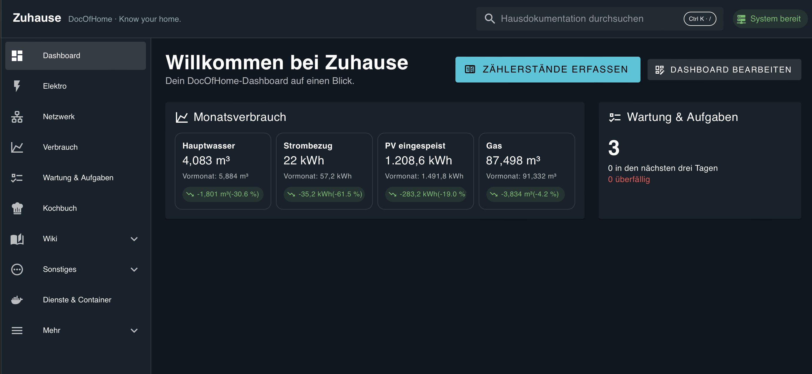
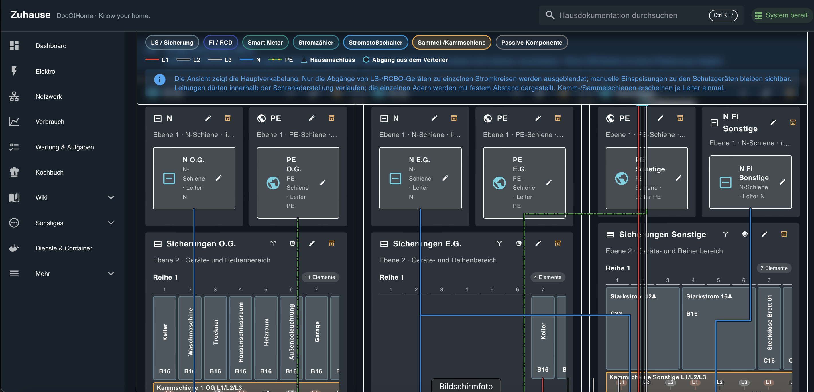
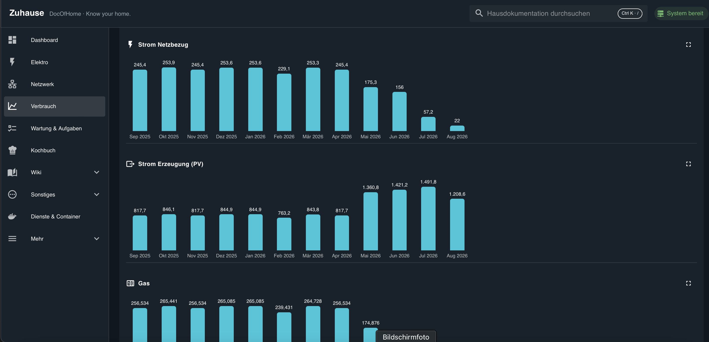
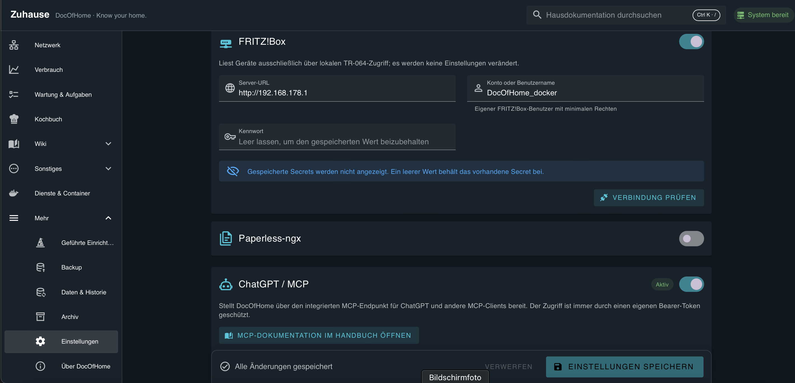
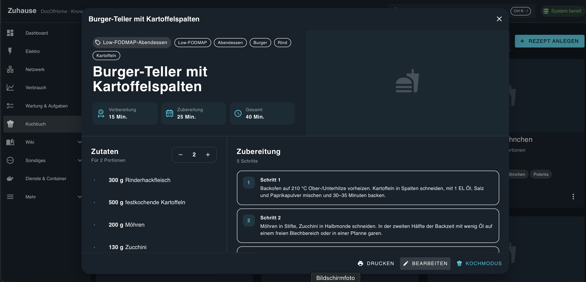

# DocOfHome – die persönliche Dokumentation für das eigene Zuhause

**Know your home.** DocOfHome ist eine selbst gehostete, containerbasierte Hausdokumentation für Technik, Netzwerk, Elektro, Verbrauch, Wartungen, Dokumente, Bilder, Wissen und wiederkehrende Aufgaben.

Das Projekt entstand aus einem persönlichen Bedarf: Mir fehlte eine flexible Möglichkeit, unser Haus genau nach meinen Vorstellungen zu dokumentieren. Deshalb habe ich DocOfHome mit Unterstützung von KI entwickelt. Was als einfache Netzwerkdokumentation begann, ist über viele Entwicklungsstunden zu einer umfangreichen digitalen Hausakte gewachsen. Die Anwendung ist stark auf meinen eigenen Alltag zugeschnitten – ich stelle sie aber gerne auch anderen zur Verfügung, die ihr Zuhause zentral und flexibel dokumentieren möchten.



## Alles rund ums Zuhause an einem Ort

DocOfHome verbindet technische Dokumentation, Verbrauchsdaten, Wartungen, Wissen und alltägliche Informationen in einer gemeinsamen Oberfläche.

- **Assets & Räume** – Geräte, Installationen, Produkte, Standorte und Beziehungen dokumentieren.
- **Netzwerk** – Geräte, Verkabelungen, Schnittstellen, IP- und MAC-Adressen sowie Netze erfassen; FRITZ!Box-Geräte automatisch erkennen und per MAC-Adresse abgleichen.
- **Elektro** – Verteilungen, Stromkreise, Schutzgeräte, Leiter, Schienen und die Topologie des Verteilerkastens dokumentieren.
- **Verbrauch** – Zählerstände, Ableseerinnerungen und Monats- oder Jahresvergleiche für Strom, Wasser, Gas und PV verwalten.
- **Wartung & Aufgaben** – wiederkehrende Tätigkeiten, Termine, Historien, Fälligkeiten, Messwerte und Kosten erfassen.
- **Kochbuch** – eigene Rezepte mit Zutaten, Portionen, Arbeitsschritten, Druckansicht und Kochmodus verwalten.
- **Bilder & Dokumente** – Dateien und Fotos mit Geräten, Räumen, Wartungen und Ereignissen verknüpfen.
- **Dienste & Container** – selbst gehostete Dienste und Docker-Container einschließlich Status, Images, Ports, Netzwerken und Mounts dokumentieren.
- **Wiki, Handbuch & Glossar** – eigenes Wissen sammeln und Funktionen sowie Fachbegriffe direkt in der Anwendung nachschlagen.

## Technische Dokumentation – vom Netzwerk bis zum Verteilerkasten

Angefangen hat DocOfHome mit der Dokumentation von Netzwerkgeräten, Verkabelungen, IP-Adressen und MAC-Adressen. Inzwischen lassen sich auch umfangreiche Elektroinstallationen strukturiert abbilden – von Verteilungen und Reihenbereichen bis zu Schutzgeräten, Sammelschienen und einzelnen Leitern.



## Verbrauch und Statistiken

Zählerstände können manuell oder über unterstützte Integrationen erfasst werden. DocOfHome berechnet daraus Verbrauchswerte und stellt Entwicklungen für Monate und Jahre übersichtlich dar. Das eignet sich unter anderem für Netzbezug, PV-Erzeugung, Einspeisung, Wasser und Gas.



## Wartungen und Lebenslaufakten

Wartungen und Ereignisse werden direkt dem passenden Bezugsobjekt zugeordnet. Dadurch entsteht eine nachvollziehbare Lebenslaufakte für Fahrzeuge, Tiere, technische Anlagen und Haushaltsgeräte.

Beispiele sind:

- Werkstatttermine, Inspektionen und TÜV eines Fahrzeugs,
- Filterwechsel am Kühlschrank oder an anderen Geräten,
- Wartungen der Heizungsanlage und Besuche des Schornsteinfegers,
- Impfungen, Untersuchungen, Messwerte und Termine eines Haustiers.

Vergangene Ereignisse und zukünftige Fälligkeiten erscheinen gemeinsam in einem Zeitstrahl. Rechnungen, Prüfberichte und andere Unterlagen können mit der jeweiligen Durchführung verknüpft werden.

## Vorhandene Dienste und Daten einbinden

DocOfHome unterstützt verschiedene optionale Integrationen:

- **Nextcloud** für Dateien und Dokumente,
- **Immich** für Bilder und Fotodokumentationen,
- **Paperless-ngx** für die Verknüpfung archivierter Dokumente,
- **FRITZ!Box** zur Erkennung und Dokumentation von Netzwerkgeräten,
- **Home Assistant** zur Zuordnung vorhandener Geräte, Entitäten und Livewerte.

So lassen sich Rechnungen, Anleitungen, Bilder und Prüfberichte mit den passenden Geräten, Räumen, Wartungen oder Ereignissen verbinden. Integrationen können einzeln aktiviert, konfiguriert und getestet werden. Gespeicherte Secrets werden nicht angezeigt und nicht in Exporte oder Diagnoseinformationen aufgenommen.



## Kochbuch für den eigenen Alltag

Das Kochbuch kam hinzu, weil für unsere Ernährung spezielle Rezepte benötigt wurden. Rezepte lassen sich strukturiert mit Zutaten, Mengen, Portionen, Zubereitungszeiten und einzelnen Arbeitsschritten erfassen. Eine übersichtliche Detailansicht, die Druckfunktion und der Kochmodus unterstützen die praktische Verwendung in der Küche.



## ChatGPT und andere Assistenten über MCP anbinden

Ein besonderes Highlight ist der integrierte MCP-Zugang. Damit kann DocOfHome direkt mit kompatiblen KI-Assistenten wie ChatGPT verbunden werden.

Damit lassen sich beispielsweise:

- neue Rezepte erstellen und direkt einpflegen,
- Netzwerkgeräte anlegen,
- technische Informationen dokumentieren,
- vorhandene Daten durchsuchen,
- und Einträge komfortabel ergänzen.

Der Zugriff ist durch einen eigenen Bearer-Token geschützt und kann vollständig deaktiviert werden.

## Modular und anpassbar

Nicht jeder Haushalt benötigt alle Bereiche. Deshalb können Funktionen und Integrationen unabhängig voneinander aktiviert oder deaktiviert werden. So lässt sich DocOfHome an den eigenen Haushalt und den gewünschten Dokumentationsumfang anpassen.

Ein integriertes Benutzerhandbuch und ein Glossar helfen beim Einstieg und erklären Funktionen sowie verwendete Begriffe.

## Installation mit Docker Compose

```bash
git clone https://github.com/Scotty042/DocOfHome.git
cd DocOfHome
docker compose up -d --build
```

Standardmäßig ist DocOfHome anschließend über Port `8088` erreichbar. Persistente Daten liegen im lokalen Verzeichnis `./data`.

### Docker-Integration auf dem UGREEN NAS

Für den lesenden Containerimport benötigt DocOfHome Zugriff auf den Docker-Engine-Socket. Die mitgelieferte `compose.yaml` bindet `/var/run/docker.sock` ein. DocOfHome selbst verwendet dafür ausschließlich lesende `GET`-Anfragen. Der Zugriff auf einen Docker-Socket ist grundsätzlich privilegiert; die Installation sollte deshalb nur in einem vertrauenswürdigen lokalen Umfeld betrieben werden.

In **Dienste & Container** anschließend:

1. das UGREEN NAS als Host-Asset auswählen,
2. den Docker-Socket prüfen,
3. das gewünschte Aktualisierungsintervall wählen,
4. **Jetzt aktualisieren** ausführen.

## Entwicklung

Backend: FastAPI, SQLModel und Alembic. Frontend: Vue 3, TypeScript und Vuetify. Die CI prüft Backend-Tests, Migrationen, Frontend-Tests und den Docker-Build.

Die vollständige Versions- und Implementierungshistorie befindet sich gebündelt in [`PROJECT_HISTORY.md`](PROJECT_HISTORY.md).

## Feedback und Unterstützung

DocOfHome ist in erster Linie aus meinen eigenen Anforderungen entstanden und wird weiterhin danach weiterentwickelt. Wenn dir eine Funktion fehlt, du einen Fehler findest oder eine Idee zur Verbesserung hast, freue ich mich über Feedback – natürlich ist auch jede andere Form der Unterstützung willkommen.

## Lizenz und Sicherheit

Siehe [`LICENSE`](LICENSE) und [`SECURITY.md`](SECURITY.md). Bitte keine Zugangsdaten, Tokens oder privaten Inhalte in Issues veröffentlichen.
